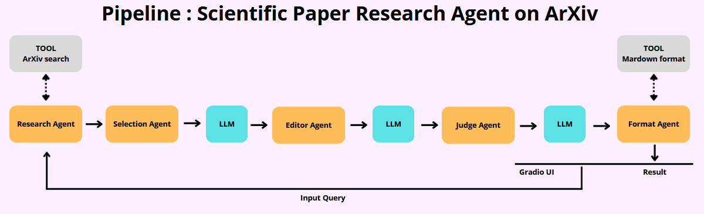

#  Scientific Paper Research Agent — ArXiv AI Pipeline

> An intelligent multi-agent system that searches, selects, summarizes, and refines scientific articles from ArXiv — powered by LLaMA 3.1 and served through a Gradio web interface.

---

##  Overview

**Scientific Paper Research Agent** is an automated research assistant built around a modular multi-agent architecture. Given a research topic, it autonomously queries the ArXiv API, identifies the most relevant articles, generates in-depth summaries, and refines them through a critic/judge pipeline — all accessible through an intuitive web UI.

This project is designed for researchers, students, and developers who want to quickly get a deep and structured understanding of the state of the art on any scientific topic.

---

## Architecture — Multi-Agent Pipeline

The system is composed of **5 specialized agents**, each with a distinct role:




---

##  Features

-  **ArXiv Search** — Fetches real-time scientific articles via the ArXiv API
-  **LLM-Powered Selection** — LLaMA 3.1 picks the two most relevant papers for your query
-  **Structured Summarization** — Each article is summarized with Overview, Methodology, Key Findings, and Implications sections
-  **AI Critic Loop** — A judge agent reviews and improves each summary for accuracy and completeness
-  **Gradio Web UI** — Clean, accessible interface; no code required to use
-  **Markdown Output** — Results formatted for easy reading, copy-paste, or integration

---
##  Project Structure
```
arxiv-agent/
│
├── main.py                    # Entry point - Gradio UI + pipeline orchestration
│
├── agents/
│   ├── __init__.py
│   ├── agent_recherche.py     # Search agent - queries the arXiv API
│   ├── agent_selection.py     # Selection agent - picks the 2 most relevant articles (LLM)
│   ├── agent_editor.py        # Editor agent - writes detailed structured summaries (LLM)
│   ├── agent_judge.py         # Judge agent - evaluates & improves summaries (LLM)
│   └── agent_format.py        # Format agent - assembles the final Markdown output
│
├── utils/
│   ├── __init__.py
│   ├── article_info.py        # Metadata enrichment utility
│   ├── arxiv.py               # arXiv API wrapper
│   └── llama.py               # Groq / LLaMA 3.1 client wrapper
│
├── requirements.txt           # Python dependencies
├── .env                       # Your API key
└── readme.pdf                 # Project documentation
```
---

##  Interface

The Gradio UI features:
- A text input for your research topic
- A **Run Research** button (or press Enter)
- A full Markdown output with all articles found + detailed selected summaries

>  The full pipeline takes approximately **40 seconds** to complete due to multiple LLM calls.

---

### Key Functions

| Function | Role |
|---|---|
| `arxiv_search()` | Queries the ArXiv API and parses XML results |
| `agent_recherche()` | Research agent — orchestrates the ArXiv search |
| `agent_selection()` | Selection agent — uses LLaMA to pick the best 2 articles |
| `agent_redacteur_par_article()` | Editor agent — writes detailed structured summaries |
| `agent_judge()` | Judge agent — critiques and improves each summary |
| `agent_format()` | Format agent — builds the final Markdown output |
| `research_pipeline()` | Orchestrates the full multi-agent pipeline |

---

##  Configuration & Parameters

| Parameter | Default | Description |
|---|---|---|
| `arxiv_count` | `10` | Number of ArXiv articles to retrieve |
| `max_tokens` | `1500` | Max tokens for LLaMA generation |
| `temperature` | `0.3` | LLM temperature (lower = more deterministic) |

---

##  Output Format

Results are structured as follows:

```
# All Articles Found (arXiv)
1. Article Title
   - Authors: ...
   - Date: ...
   - Link: ...

# Selected Research Articles

## 1. [Most Relevant Article Title]
- Authors: ...
- Publication Date: ...
- Link: ...

### Summary
[Overview / Methodology / Key Findings / Implications]

---
```

---

##  Tech Stack

| Tool | Usage |
|---|---|
| [ArXiv API](https://arxiv.org/help/api) | Scientific paper source |
| [LLaMA 3.1 8B Instant](https://groq.com) | LLM backbone (via Groq) |
| [Gradio](https://gradio.app) | Web UI framework |
| Python `xml.etree` | ArXiv XML parsing |
| Python `json` | LLM structured output parsing |

---

##  Contributing

Contributions, issues, and feature requests are welcome! Feel free to open an issue or submit a pull request.

---

##  License

This project is open source and available under the [MIT License](LICENSE).

---
